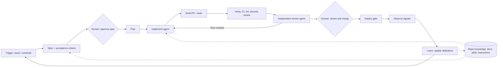

# Agentic software factory – reference flow

```mermaid
flowchart LR
  T[Trigger: issue / schedule] --> S[Spec + acceptance criteria]
  S --> G1{Human: approve spec}
  G1 --> P[Plan]
  P --> I[Implement agent]
  I --> PR[Draft PR + tests]
  PR --> V[Verify: CI, lint, security review]
  V --> R[Independent review agent]
  R -->|fixes needed| I
  R --> G2{Human: review and merge}
  G2 --> D[Deploy gate]
  D --> O[Observe signals]
  O --> L[Learn: update skills/docs]
  L --> T
  K[(Repo knowledge: docs, skills, instructions)] -.-> S
  K -.-> I
  L -.-> K
```
